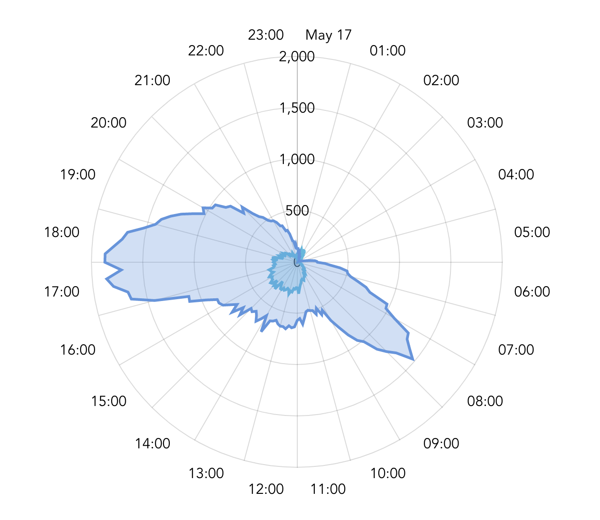

# Radial Chart

## Why

I wanted to plot the data that is tightly connected to a time of a day 
as a circular chart, resembling the clock face - for no particular reason other than checking out how it looks.

Another thing I wanted to do was to play with some relatively modern JS framework.

And then I also got a bit a of a spare time on my hands.

## What

So as a result, here's a code that fetches CSV data from Graphite metrics (or any other CSV file) and displays it on a radial chart (aka Radar chart).
It's crude and unoptimised and inefficient, but it serves the goal of visual representation (see examples section below).

It's mostly an amCharts showcase - amCharts are amazing, I love them dearly. Check them out if you're not familiar, there's seemingly nothing you can't do with them: https://www.amcharts.com/demos/

Additionally, it also uses Github Actions (https://help.github.com/en/actions) as a CI mechanism - so on every push a build is pushed 
to a branch and then deployed as Github pages using https://github.com/marketplace/actions/github-pages-action#%EF%B8%8F-publish_branch
(there's many action plugins, this one was just the first one that worked).    

## Examples
Surprisingly, there's npt that many public datasets with high-granularity daily data available on the Internet, but here's at least one:   
Bike rentals in NYC, January 1st 2020 vs July 1st 2019 (from https://s3.amazonaws.com/tripdata/index.html):
- https://hydralien.github.io/Radial-Charts/?refdate=today&charturl=https%3A%2F%2Fraw.githubusercontent.com%2Fhydralien%2FRadial-Charts%2Fmaster%2Fdata%2Fcitybike-2020-01-01.csv&charturl=https%3A%2F%2Fraw.githubusercontent.com%2Fhydralien%2FRadial-Charts%2Fmaster%2Fdata%2Fcitybike-2020-07-01.csv



## Shortcomings

- it's not a working tool or a developing project - it's a fun thing built for no reason 
- it loads a ton of unnecessary libraries, becasue how amCharts library for Vue.js is structured, and also because it's not optimised for anything
- &lt;_many other things_&gt;

## Vue auto-generated help, JIC

### Project setup
```
yarn install
```

#### Compiles and hot-reloads for development
```
yarn serve
```

#### Compiles and minifies for production
```
yarn build
```

#### Lints and fixes files
```
yarn lint
```

#### Customize configuration
See [Configuration Reference](https://cli.vuejs.org/config/).
